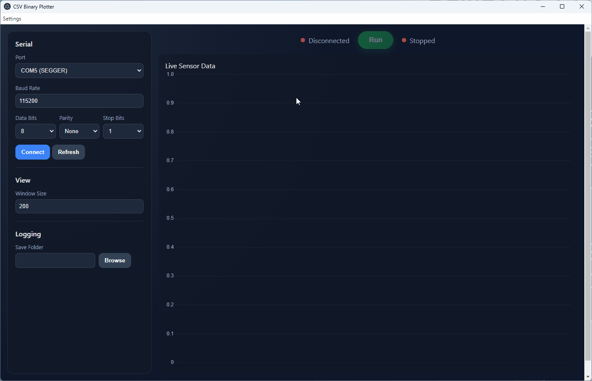

# CSV Binary Plotter

---

## Overview

The CSV Binary Plotter is a tool used to stream encoded binary data, CSV formatted, from a serial port and plot it.
It is an electron app, therefore written in a mixture of javascript, html & css.
The project also comes with an example C code based encoding library used as an example for encoding raw data and transmitting it as per the defined protocol.

The need for this project came from operating in resource constrained embedded environments where a need to view internal data (such as ADC readings) in real time and store the results for analysis.

---

## What's Included
The project is structured as follows:
```
├── C/src           # Example C encoder library for embedded systems<br>
├── C/README.md     # Readme document for learning how to port the project<br>
├── src/            # Electron application source code (UI, serial handling, plotting)<br>
└── README.md       # This document
```

### Components

- **Electron App (`src/`)**
  - Handles serial communication
  - Parses incoming CSV-formatted binary data
  - Plots data in real time
  - Provides a user interface for interaction

- **C Encoder Example (`C/`)**
  - Demonstrates how to structure and encode data on an embedded device
  - Implements the expected transmission protocol
  - Can be adapted to your target platform

---

## Getting Started

### Prerequisites

- https://nodejs.org/ (recommended LTS version)
- npm (comes with Node.js)
- A serial device sending properly encoded CSV binary data

### Installation Source

Clone the repository:
```bash
git clone <https://github.com/lwray-renesas/CSVBinaryPlotter.git>
cd CSVBinaryPlotter
```

Install dependencies:
```bash
npm install
```

### Running Source

Start the Electron app:
```bash
npm start
```

### Release Page
Alternatively you can just pick the installer from the release page and run the application natively.

---

## Using the Tool

1. Connect your embedded device to your machine via serial (USB/UART).
2. Ensure your device is transmitting data using the expected encoding format (see C/ example).
3. Launch the application.
4. Select the appropriate serial port & click connect.
5. Optionally navigate to a folder to enable the application to store any streamed data.
6. Click Run to observe the data stream and Stop to end the session.

Steps 4, 5 & 6 are shown in the image below.



### File Save Behaviour

If you choose to use the file save behaviour, the tool will automatically generate a save file on each run.
The file saved will be CSV formatted, with all meta data in first 3 lines & the conversion from raw binary to ascii completed.

The file will be saved in the folder chosen, with the name format:
```
data_DD_MM_YYYY_HHMMSS.csv
```

So each run has a unique identifier.


---

## Using the C Encoder Example
Follow the instruction in C/README.MD

---

## Protocol Breakdown

The CSV Binary Protocol is a lightweight, stream-oriented data format designed for transmitting structured numerical data from embedded systems to host applications.

It combines:

- The simplicity and readability of CSV
- The efficiency of raw binary data
- A self-describing metadata layer

The protocol is designed to operate over byte-stream transports such as UART, USB CDC, or TCP, with no requirement for packet framing.

### 1. Stream Structure

A valid CSVBin stream consists of two logical sections:

1. **Metadata Section** - defining how subsequent data rows should be interpreted
2. **Data Section** - raw csv binary data

### 2. Metadata Format

Metadata messages begin with the `#` character and are ASCII encoded.

Each metadata message is terminated by a newline (`\n`).

#### 2.1 Metadata Types

| Identifier | Description |
|------------|-------------|
| `#N`       | Column names |
| `#T`       | Column data types |
| `#E`       | Endianness of binary data |

#### 2.2 Metadata Definitions

##### 2.2.1 Column Names (`#N`)
Defines the number and names of fields per row.
Example:
```
#Nvoltage,current,temperature`\n`
```

##### 2.2.2 Column Types (`#T`)
Defines the binary type and size of each column.
Supported types:

| Type | Size (bytes) | Description |
|------|--------------|-------------|
| u8   | 1            | Unsigned 8-bit |
| i8   | 1            | Signed 8-bit |
| u16  | 2            | Unsigned 16-bit |
| i16  | 2            | Signed 16-bit |
| u32  | 4            | Unsigned 32-bit |
| i32  | 4            | Signed 32-bit |
| u64  | 8            | Unsigned 64-bit |
| i64  | 8            | Signed 64-bit |
| f32  | 4            | IEEE 754 float |
| f64  | 8            | IEEE 754 double |

Example:
```
#Tf32,u16,i32`\n`
```

##### 2.2.3 Endianness (`#E`)

Defines byte order for all binary fields.

```
#Elittle|big`\n`
```

#### 2.3 Metadata Requirements

- Metadata **must be transmitted before data rows**
- Parsing is considered valid once:
  - Names (`#N`)
  - Types (`#T`)
  - Endianness (`#E`)
  are all received
- Metadata may be repeated at any time to redefine the format

#### 2.4. Metadata Request

- The host application will request all meta data by transmitting character:
```
'M'
```
- It is the only time the host application will transmit data to the streaming device - so it is also safe to assume, any correctly received byte is a request for meta data transmission.
- Meta data can be sent in any order.

### 3. Data Row Format

Each data row is a CSV-formatted sequence of binary fields.
Where:
- Comma (`0x2C`) separates fields
- Newline (`0x0A`) terminates a row

Each field consists of **binary data**, not ASCII text.

```
x,y,z`\n`
```

### 4. Binary Encoding and Escaping

To ensure safe transmission within a CSV structure, certain reserved characters are escaped.

#### 4.1 Reserved Characters

| Character | ASCII | Description |
|----------|-------|-------------|
| `,`      | 0x2C  | Field separator |
| `\n`     | 0x0A  | Row terminator |
| `#`      | 0x23  | Metadata indicator |
| `\`      | 0x5C  | Escape character |


#### 4.2 Escape Mechanism

The protocol uses a byte-stuffing scheme:
```
ESC  = 0x5C
MASK = 0x20
```

If a byte matches any reserved character:
```
output: ESC + (byte XOR MASK)
```
Otherwise:
```
output: byte
```


#### 4.3 Decoding Rule

On reception:
```
if (previous_byte == ESC)
decoded_byte = current_byte XOR MASK
else
decoded_byte = current_byte
```

### 5. Field Parsing

Each field is reconstructed as a binary buffer and interpreted using metadata.

#### 5.1 Parsing Pipeline
Incoming Bytes
→ Escape Decoding
→ Field Extraction
→ Buffer Assembly
→ Typed Conversion
→ Output Values


#### 5.2 Typed Conversion

Each field is parsed using:

- Declared type (`#T`)
- Declared endianness (`#E`)

Example:
```
f32 + little endian → readFloatLE()
u16 + big endian    → readUInt16BE()
```

---
## License

This project is licensed under the following [terms](https://www.renesas.com/en/document/oth/disclaimer015?srsltid=AfmBOorceqdmsAs42rxoYYHQwnXI3aHFoXRORrRm2e6OUmqg12zxtsEM).

